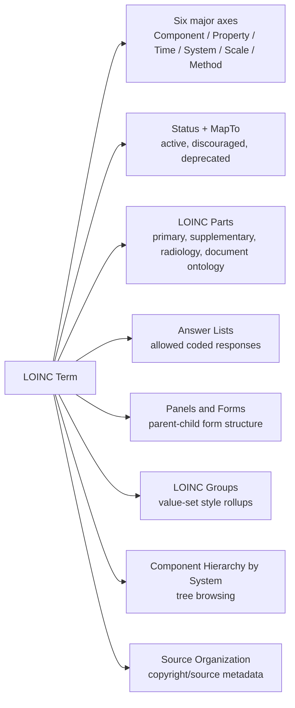
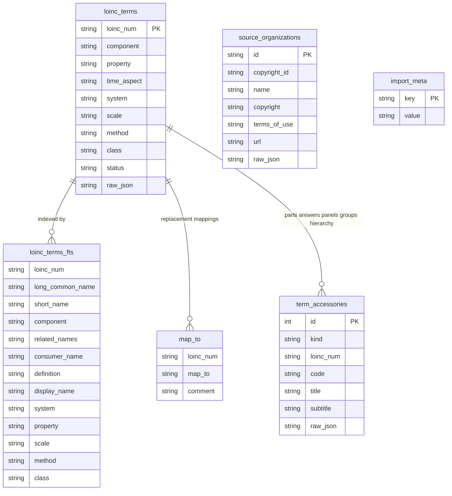

# LOINC Browser ERD

This document summarizes the relationship model in the LOINC release artifacts and how the browser currently stores those relationships.

## LOINC Release Relationship Model

## Conceptual Map

## Current Browser Storage Model

The browser currently keeps the main term table normalized enough for search and facets, and stores accessory relationships in a generic table keyed by `kind`.

## `term_accessories.kind`

Current values:

- `part-primary`
- `part-supplementary`
- `answer-list`
- `panel-membership`
- `panel-child`
- `group`
- `hierarchy`

This generic table lets the app ingest and browse relationship artifacts immediately. If a workflow becomes central, it can later be promoted into a dedicated normalized table, such as:

- `loinc_part_links`
- `loinc_answer_list_links`
- `loinc_panel_links`
- `loinc_group_members`
- `loinc_hierarchy_nodes`

