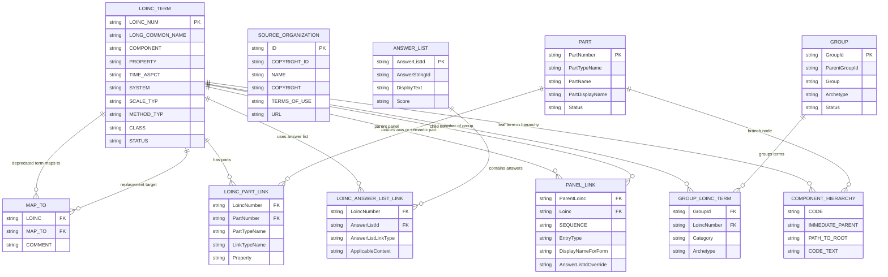
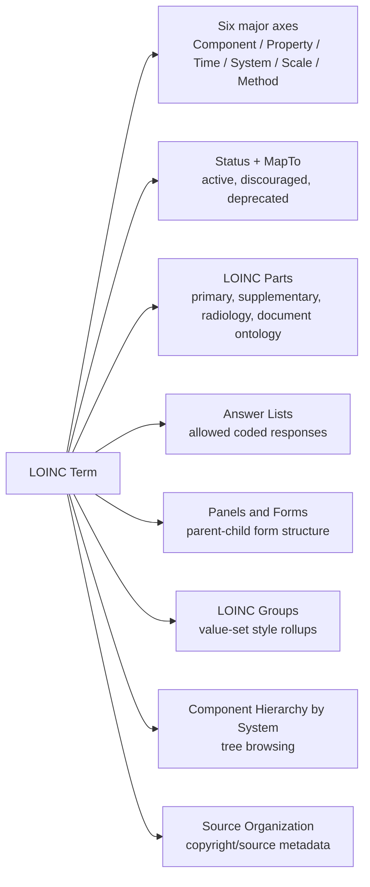
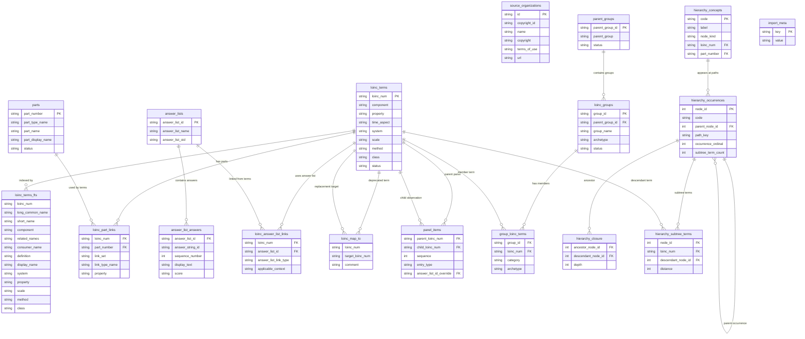

# LOINC Browser ERD

This document summarizes the relationship model in the LOINC release artifacts and how the browser stores and queries those relationships. The `/api/v1` routes read the normalized tables directly; relationship data is not copied into compatibility tables or raw JSON columns.

## LOINC Release Relationship Model

## Conceptual Map

## Current Browser Storage Model

The browser now imports relationship data into normalized tables with foreign keys. `loinc_terms` remains the canonical term table and `loinc_terms_fts` remains the search index. Relationship data is no longer written into generic compatibility tables.

Hierarchy codes are concept identifiers, not unique tree positions. The same code can appear in more than one branch, so `hierarchy_occurrences` stores path occurrences using `node_id`, `path_key`, and `occurrence_ordinal`; `hierarchy_concepts` stores the unique code identity. API hierarchy browsing and branch-scoped term queries use `node_id`.
