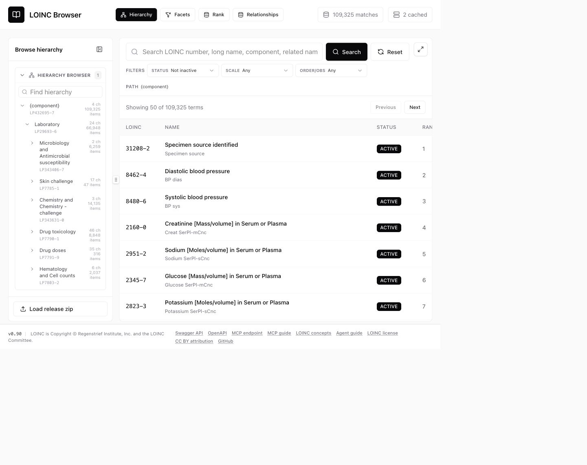
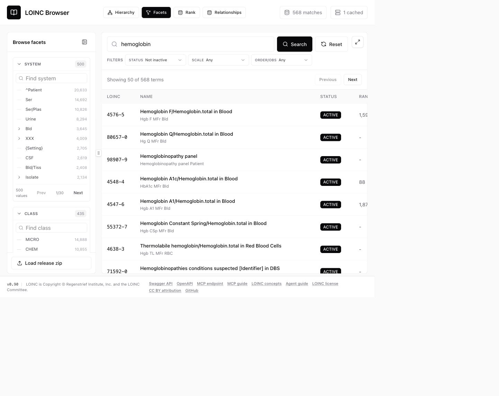
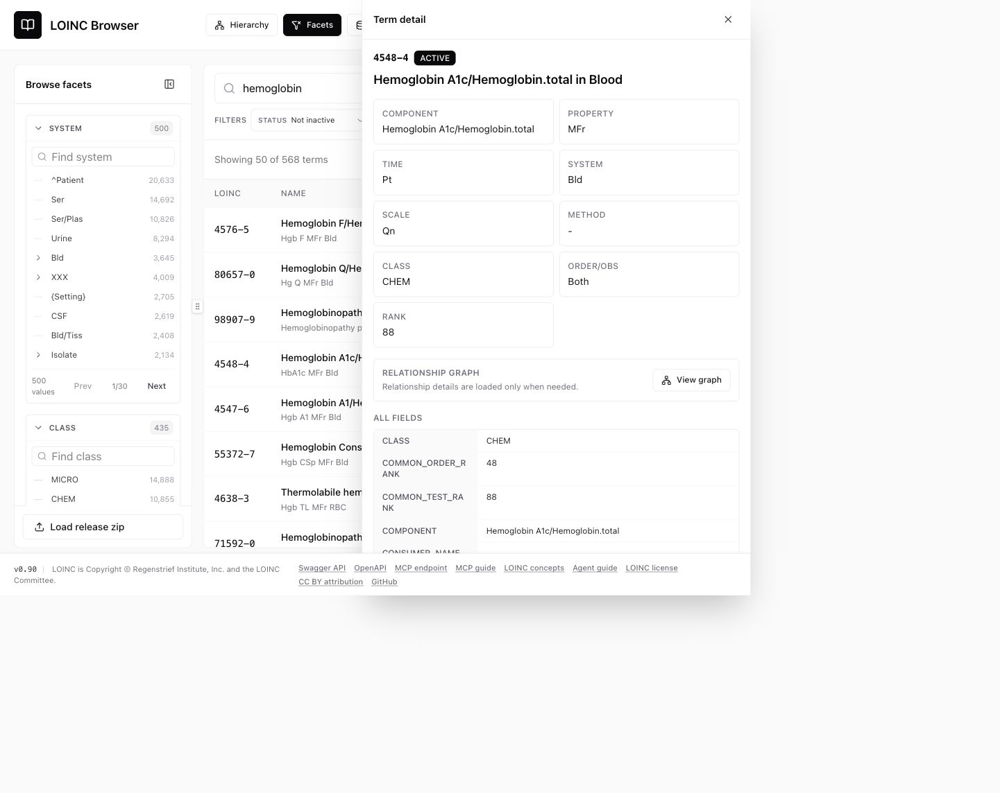
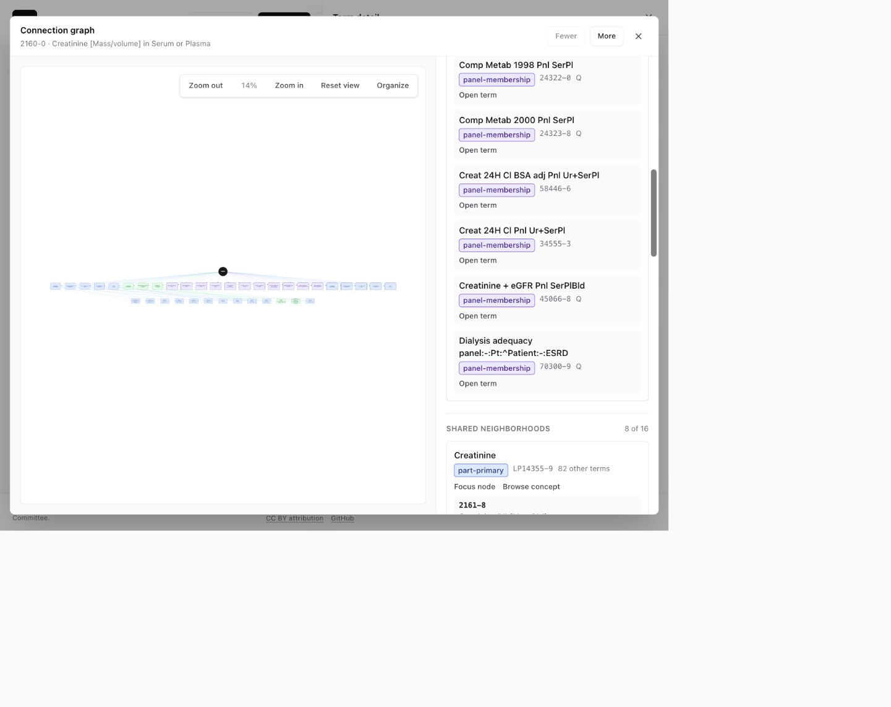
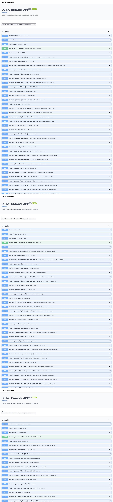
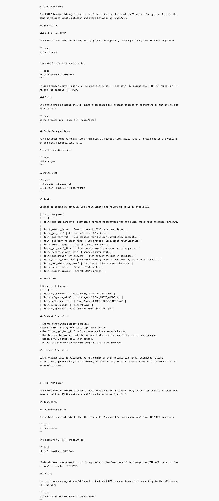

# LOINC Browser

Local browser for a licensed LOINC release. The code imports every term row from `LoincTable/Loinc.csv` into typed SQLite columns, imports required relationship/accessory artifacts into normalized foreign-key tables, builds an FTS5 index over the searchable LOINC fields, and serves a Svelte search UI from a Go binary.

Licensed LOINC release files and generated SQLite databases must stay out of git.

## Features

- One executable starts the Svelte UI, normalized JSON API, Swagger/OpenAPI docs, and HTTP MCP server.
- First run can auto-import a local licensed LOINC 2.82 release ZIP into `./data/loinc-normalized.sqlite`.
- UI supports ranked search, facets, hierarchy browsing, panels/forms, answer lists, parts, groups, source metadata, and term relationships.
- API exposes normalized `/api/v1` endpoints for EMR form-builder and scripting workflows.
- MCP exposes context-optimized LOINC tools/resources over HTTP at `/mcp` and over stdio for agent configs.
- Agent guidance is backed by editable Markdown docs under `docs/agent/`, served live by the Go app.
- Repository skill file at `skills/loinc-mcp/SKILL.md` helps agents connect to the local MCP server.
- Release packages contain code and docs only. Licensed LOINC data and generated databases are not bundled.

## Screenshots

### Browser UI



### Search And Term Detail







### API And MCP Docs





## Getting Started Quickly

1. Download the `v0.92` binary for your platform from GitHub Releases.
2. Download the licensed LOINC 2.82 release ZIP from LOINC after accepting the LOINC license.
3. Place the release ZIP beside the executable, for example `Loinc_2.82.zip`.
4. Run one command.

macOS arm64 or Linux amd64:

```bash
./loinc-browser
```

Windows amd64 PowerShell:

```powershell
.\loinc-browser.exe
```

Open `http://localhost:9005`. The executable serves the UI, `/api/v1`, Swagger UI, `/openapi.json`, and HTTP MCP at `/mcp`.

The app uses `./data/loinc-normalized.sqlite`. If that database is missing or empty, startup looks for a local `Loinc*.zip` and imports it automatically. To use a different port:

```bash
./loinc-browser 9090
# or
./loinc-browser --port 9090
```

Use `./loinc-browser --addr 127.0.0.1:9090` only when you need a full listen address.

## MCP Server

The default run mode exposes the local LOINC database to agents through MCP over HTTP while also serving the UI, API, and Swagger docs.

All-in-one local server:

```bash
./loinc-browser
```

The default HTTP MCP route is `http://localhost:9005/mcp`. Editable agent docs live under `docs/agent/` and are read from disk at request time.

Stdio MCP remains available for agent configs that launch a dedicated MCP process:

```bash
./loinc-browser mcp --docs-dir ./docs/agent
```

See `docs/MCP.md` for tool/resource names, connection examples, and context-optimization guidance.

## Agent Skill

The repository skill file is:

```text
skills/loinc-mcp/SKILL.md
```

Use it when an agent needs to connect to the local LOINC MCP server, choose HTTP versus stdio transport, or understand the context-optimized tools and resources. The live Markdown concept guides are served at:

- `http://localhost:9005/docs/mcp`
- `http://localhost:9005/docs/concepts`
- `http://localhost:9005/docs/agent-guide`

The agent KB is split into focused Markdown files:

- `docs/agent/LOINC_CONCEPTS.md`: overview, scope, search strategy, and topic map.
- `docs/agent/LOINC_TERM_STRUCTURE.md`: identifiers, major parts, abbreviations, and structural metadata.
- `docs/agent/LOINC_NAMES_AND_DISPLAY.md`: FSN, Long Common Name, Short Name, and display guidance.
- `docs/agent/LOINC_SPECIAL_CASES.md`: mapping patterns for microbiology, antimicrobial susceptibility, molecular genetics, allergy, urinalysis strips, and related special cases.
- `docs/agent/LOINC_DATABASE_STRUCTURE.md`: technical reference for LOINC release fields, replacement mappings, source organizations, and import guidance.
- `docs/agent/LOINC_PART_LINKAGES.md`: technical reference for enriched term-to-part linkages, link types, properties, and import guidance.
- `docs/agent/LOINC_LICENSE_NOTE.md`: license, copyright, and repository data-handling constraints.

## UI Browsing

The browser UI is served at:

```text
http://localhost:9005
```

It supports ranked search, browse-by-hierarchy, facets, relationship exploration, panels/forms, answer lists, parts, groups, and source/copyright metadata. v1 term lists exclude `STATUS=INACTIVE` by default; pass `status=INACTIVE` to search inactive terms, or `status=*` to include every status.

The browser also includes a local loader for uploading a licensed LOINC release ZIP. Uploaded releases are extracted under `data/uploads/`, ingested into the configured SQLite database, and remain outside git.

## API Endpoint

The same executable exposes JSON endpoints for scripts and other apps. The `/api/v1` routes are the normalized API surface for EMR form-builder workflows.

```bash
curl 'http://localhost:9005/api/version'
curl 'http://localhost:9005/api/v1/terms/search?q=glucose&usageType=observation&rankMode=observation&sort=relevance'
curl 'http://localhost:9005/api/v1/terms/top?rankMode=observation&limit=10'
curl 'http://localhost:9005/api/v1/terms/14749-6'
curl 'http://localhost:9005/api/v1/terms/14749-6/relationships'
curl 'http://localhost:9005/api/v1/hierarchy/roots'
curl 'http://localhost:9005/api/v1/answer-lists/search?q=positive'
curl 'http://localhost:9005/api/v1/source-organizations'
curl -X POST 'http://localhost:9005/api/v1/official/search' \
  -H 'content-type: application/json' \
  -d '{"scope":"loincs","query":"Component:glucose","rows":10,"username":"LOINC_USERNAME","password":"LOINC_PASSWORD"}'
curl -F 'releaseZip=@./Loinc_2.82.zip' 'http://localhost:9005/api/import/upload'
```

Swagger UI is served at `http://localhost:9005/api/docs`. The underlying OpenAPI 3.1 spec is served at `http://localhost:9005/openapi.json`. See `docs/API.md` for the structured v1 API guide.

## Official LOINC Search API

The browser includes a dedicated **Official API** mode for querying Regenstrief's official LOINC Search API. The mode is opened from the Modes menu next to hierarchy, facets, rank, and relationships.

The local server proxies official API requests so credentials are not sent in browser URL query strings. You can enter credentials per search or save them locally. Saved credentials are encrypted into `./data/loinc-browser-kv.json` using a random app key in `./data/loinc-browser-app.key`. Both files are local generated data and must stay out of git.

Official search results are also checked against the local offline SQLite database when LOINC codes are present in the upstream payload. The results window marks local matches and can open matched terms in the local detail pane while keeping the official raw JSON available.

The planned and local Lucene-style index, fields, query syntax, and generated index lifecycle are documented in [`docs/LOCAL_LUCENE_SEARCH.md`](docs/LOCAL_LUCENE_SEARCH.md).

The app loads `.env` and then `loinc.env` when present. Use `loinc.env` for local test credentials or official API settings:

```bash
LOINC_OFFICIAL_API_BASE_URL=https://loinc.regenstrief.org/searchapi
LOINC_APP_KEY_PATH=./data/loinc-browser-app.key
LOINC_KV_PATH=./data/loinc-browser-kv.json
```

Local app-key encryption protects against casual inspection of the KV file. Anyone with both the app key file and KV file can decrypt saved credentials, so treat both files as secrets.

## High-Level Relationship Model

The browser treats `LoincTable/Loinc.csv` as the canonical term table. Everything else enriches those terms with normalized relationships or source metadata:

- `loinc_map_to`: direct term-to-term replacement links, mainly for deprecated terms.
- `parts` and `loinc_part_links`: term-to-concept links for component, property, system, method, and other semantic parts.
- `answer_lists`, `answer_list_answers`, and `loinc_answer_list_links`: answer-list identity, answer rows, and term usage.
- `panel_items`: parent-child term relationships for panels, forms, and their member observations.
- `parent_groups`, `loinc_groups`, and `group_loinc_terms`: value-set style groupings that collect related LOINC terms.
- `hierarchy_concepts`, `hierarchy_occurrences`, `hierarchy_edges`, `hierarchy_closure`, and `hierarchy_subtree_terms`: path-preserving hierarchy browsing and fast branch-scoped term queries.
- Source organizations: copyright, source, and terms-of-use metadata for imported source references.

The v1 API exposes focused resources for term search, term detail, grouped relationships, hierarchy nodes, panel items, answer lists, parts, groups, and source/copyright metadata. Hierarchy browsing uses `hierarchy_occurrences.node_id` so duplicate hierarchy concept codes are safe to browse.

The app also supports **Browse by rank**, based on LOINC's `COMMON_TEST_RANK` and `COMMON_ORDER_RANK` fields. Ranked browsing can use observation or order rank mode, limits results to positive ranks when requested, and orders the most frequently used LOINC codes first. Unranked terms remain searchable through normal search and facet browsing.

See `ERD.md` for the fuller relationship diagram and storage model.

## Local Abbreviation Lookup

To build a local CSV lookup from the [LOINC abbreviations and acronyms page](https://loinc.org/kb/abbreviations/), run:

```bash
/Users/vivekgupta/.codex/.venv/bin/python scripts/build-loinc-abbreviations-csv.py
```

The generated file is `data/loinc-abbreviations.csv`. It is intended for local UI/API experiments or a future ingest step into SQLite/Go lookup code. The `data/` directory is ignored so the generated LOINC-derived CSV remains outside source control.

## License and Attribution

This repository contains application code and documentation only. It does not include the LOINC release, generated SQLite databases, or redistributed LOINC Licensed Materials.

LOINC content is owned by its respective rights holders and remains governed by the [LOINC Copyright Notice and License](https://loinc.org/kb/license/). When you use this browser with a local LOINC release, the following LOINC notice applies:

> This material contains content from LOINC (http://loinc.org). LOINC is Copyright © Regenstrief Institute, Inc. and the Logical Observation Identifiers Names and Codes (LOINC) Committee and is available at no cost under the license at http://loinc.org/license. LOINC® is a registered United States trademark of Regenstrief Institute, Inc.

Third-party content surfaced from LOINC release fields, including `EXTERNAL_COPYRIGHT_NOTICE`, remains subject to the relevant third-party copyright and terms. Project documentation and non-LOINC explanatory text may be reused with attribution under [CC BY 4.0](https://creativecommons.org/licenses/by/4.0/). Project source: [GitHub](https://github.com/drguptavivek/loinc-browser).

## Development Mode

From source, use:

```bash
make install
make serve
```

The serve address can also come from `.env`:

```bash
LOINC_BROWSER_ADDR=:9005
# or
PORT=9005
```

See `.env.example` for the supported keys.

On `serve`, if the configured database is missing or has no `loinc_terms` data, the app looks for `Loinc*.zip` beside the executable/current run directory and imports it automatically. Existing populated databases are not overwritten.

Use Vite during UI work so Svelte changes hot-reload without rebuilding embedded assets:

```bash
make dev
```

This starts two processes:

- Go API on `http://localhost:9005`, restarted when Go source files change
- Vite HMR UI on `http://localhost:5173`, proxying `/api` and `/openapi.json` to the Go API

You can also run them separately:

```bash
make dev-api
make dev-web
```

Override ports when needed:

```bash
make dev ADDR=:9090 DEV_WEB_PORT=5174
```

The importer requires these release files and fails if any are missing:

- `LoincTable/MapTo.csv` for deprecated-term replacement mappings
- `LoincTable/SourceOrganization.csv` for source/copyright metadata
- `AccessoryFiles/PartFile/Part.csv`
- `AccessoryFiles/PartFile/LoincPartLink_Primary.csv`
- `AccessoryFiles/PartFile/LoincPartLink_Supplementary.csv`
- `AccessoryFiles/AnswerFile/AnswerList.csv`
- `AccessoryFiles/AnswerFile/LoincAnswerListLink.csv`
- `AccessoryFiles/PanelsAndForms/PanelsAndForms.csv`
- `AccessoryFiles/GroupFile/ParentGroup.csv`
- `AccessoryFiles/GroupFile/Group.csv`
- `AccessoryFiles/GroupFile/GroupLoincTerms.csv`
- `AccessoryFiles/ComponentHierarchyBySystem/ComponentHierarchyBySystem.csv`

The v1 API endpoints read normalized relationship tables directly; there are no compatibility relationship tables or raw JSON fallback columns. Ingest also creates generated `raw_csv_*` tables, one per source CSV, so original release columns are preserved locally for audit and future field promotion.

## Check

```bash
go test ./...
npm --prefix web run check
npm --prefix web run build
```

## GitHub Releases

GitHub releases are created automatically by GitHub Actions. The release workflow is configured in `.github/workflows/release.yml`.

To create a release, push a version tag:

```bash
git tag v0.92
git push origin v0.92
```

The workflow builds and uploads these release assets:

- `loinc-browser_<version>_darwin_amd64.tar.gz`
- `loinc-browser_<version>_darwin_arm64.tar.gz`
- `loinc-browser_<version>_linux_amd64.tar.gz`
- `loinc-browser_<version>_windows_amd64.zip`

These packages include the app binary, `README.md`, `INSTALL.md`, `VERSION.md`, and the `loinc-mcp` skill. They do not include licensed LOINC release files or generated SQLite databases.

The workflow also smoke-tests the Linux amd64 and Windows amd64 binaries before publishing the release.

For optional local packaging checks only:

```bash
make release VERSION=0.92
```

Local packages are written under `dist/`; GitHub release assets should normally come from the workflow.
